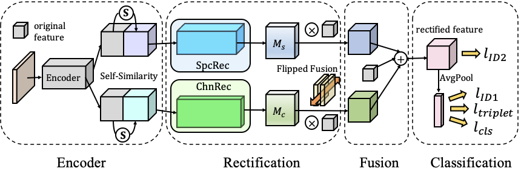

# FFR-Net

The work of "*A Unified Framework for Masked and Mask-Free Face Recognition via Feature Rectification*".

## Introduction
We introduce a unified framework, named Face Feature Rectification Network (FFR-Net), for masked and mask- free face recognition. Experiments show that our frame- work achieves the best average performance on mixed datasets (mask and mask-free faces) with a single model. Besides, we propose rectification blocks (RecBlocks) to rectify features of masked or mask-free faces in both spatial and channel dimensions. RecBlocks can maximize the consistency between masked faces and their mask-free counterparts in the rectified feature space.



## Environment
The work is with **Python 3.6** and **PyTorch 1.7**.

## Pretrained Models

We provied 2 pretrained models:

| models | pretrained file | mask-free | masked |
| :-----:| :----: | :----: | :----: |
| SENet50 | [se50.pth](https://drive.google.com/file/d/1qiu_emStHGt_b_ZVeaAKWjYovAR3q1n5/view?usp=sharing) | ✔ | ✔ |
| FFR-Net | [FFRNet.pth](https://drive.google.com/file/d/1kVlQHCVynkVXW6cWHS1cVS-4D8_dMTwg/view?usp=sharing) | ✔ | ✘ |

Our model is trained on augmented CASIA-WebFace dataset. Note that the pretrained weight of SENet is fixed during the training process.

## Quick start
Type the following commands to train the model:
```
python3 run.py
```